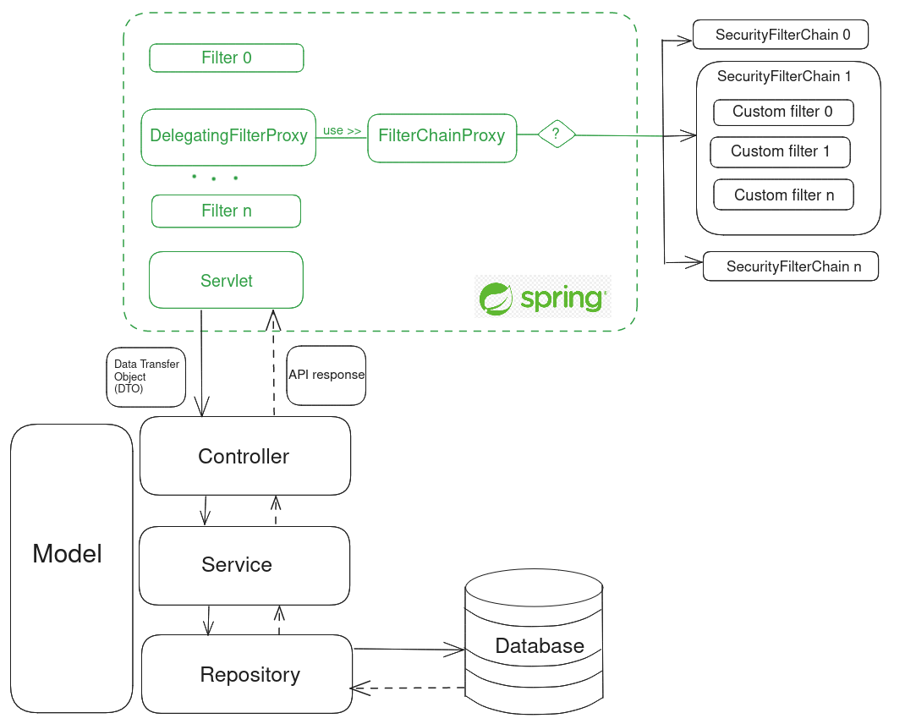

# Backend boilerplate with Spring Framework

### Motivation
Build a robust, production-ready backend boilerplate using Spring Framework, 
Docker and Gradle. Secure API with Role-Privileges based access control using 
Spring Security.  

This repo also serves as a knowledge base for Java, Gradle, Spring Core and
Spring Security.

### Table of Contents
- [Overview](#overview-)
  - [Stack](#stack-)
  - [Architecture](#architecture)
- [Project Structure](#project-structure-)
- [Prerequisites](#prerequisites-)
- [Installation](#installation-)
- [Usage](#usage-)
- [Knowledge Base](#knowledge-base)  
    - [Java](#java)
    - [Gradle](#gradle-)
    - [Spring Core](#spring-core)
    - [Spring Security](#spring-security)

### Overview  
#### Stack 
Spring Boot, Spring Security, SQL, Docker
#### Architecture
A picture is worth a thousand words !  

The green section is managed by Spring and the black section is our backend.
The SecurityFilterChain section is where we write the API security logic with Spring Security.
There are still some services to make it works. For full spring security 
architecture explanation, see [Spring Security](#spring-security)

We use a layered architecture where each layer is unaware of 
the layers above it. A layer only interacts with the layer 
directly below it and is utilized by the layer directly above it.

### Project Structure  
### Prerequisites  
### Installation  
### Usage  
### Knowledge Base
#### Java
**Q: What is Java and Why Java ?**  
A: TODO  

**Q: What is Jar / War / Fat Jar file ?**  
A: TODO  

**Q: JDK, JRE, JVM and ClassPath ?**  
A: TODO  

**Q: How does Jar file look like ?**  
A: TODO

**Q: How does ClassPath look like ?**  
A: TODO  

**Q: How `java -jar file.jar` work ?**  
A: TODO  
#### Gradle  
**Q: What is Gradle and Why Gradle ?**  
A: TODO

**Q: Gradle file structure in project ?**  
A: TODO

**Q: What is KTS file ?**  
A: TODO  

**Q: Gradle Wrapper ?**  
A: TODO

**Q: Gradle basic usage ?**  
`./gradlew tasks`  
A: TODO  

`./gradlew bootRun`  
A: TODO  

`./gradlew bootJar`  
A: TODO  

`./gradlew build`  
A: TODO  

**Q: The two spring plugins in build.gradle.kts ?**  
A: TODO  

#### Spring Core
#### Spring Security
